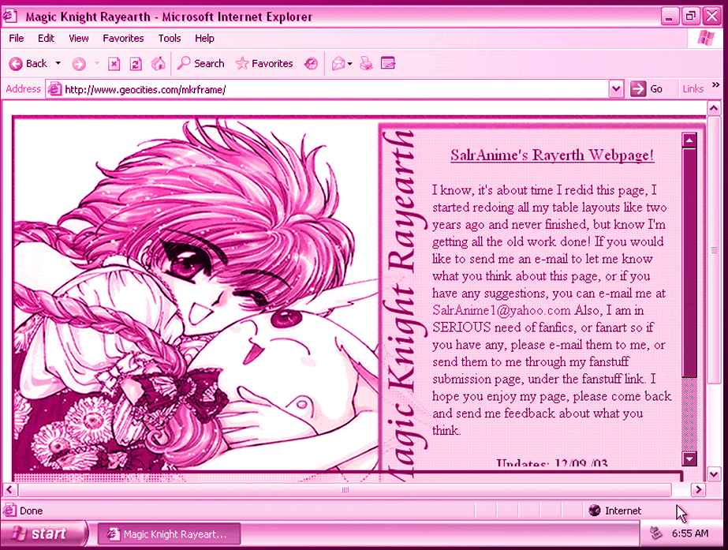

### Overview

  Fan pages were hallmarks of the early net. They represented a casual and spontaneous quality where users created ultra stylized environments to celebrate their interests. For this activity, I&rsquo;d like you to create a fan page for someone or something you deem deserving of the honor. Consider what qualities of the person/object are most visual and descriptive. Embrace the person/object and design a website that fully embodies their spirit. All assets on the site must be made by you (however, editing or collaging found assets in a meaningful way is OK).
  

  The website should be contained to a single page, but you can think about what kinds of content (text, images, videos, animation) tell the clearest story. While we&rsquo;re looking to the past for this project conceptually, the design of the website should feel like it is from 2020 and designed with a contemporary design sensibility.

### Specs
- Single page website
- HTML & CSS
- Hosted on GitHub pages

### Learning Goals
- Develop mixed media content that supports your idea
- Develop a visual tone of voice for the website that touches on writing as well as the visual design
- Project development from sketch to programming
- Experiment with HTML & CSS

### Suggested Reading
- <a href="https://anthology.rhizome.org/one-terabyte-of-kilobyte-age" target="_blank">One Terabyte of Kilobyte Age</a>
- <a href="https://fumblers.ca/" target="_blank">Fumblers.Ca</a>

### Due Date
10/26
