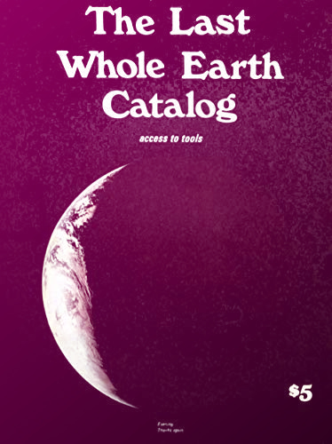

### Overview

  
  Are.na, a platform for organizing research, was created around the idea of generosity. Are.na aims to provide a healthy way of using the internet. As a designer, you can craft experiences for users that influence how they spend their time and see the world. With this in mind, create a mobile application OR responsive website that is helpful in some way. Reflect on how you use the internet and where you see an opportunity for a complementary experience. As a class, we'll explore biases in algorithms and technology, and this project could be a way to respond to this theme. The only requirement is that your project is helpful to an audience larger than yourself.
  We&rsquo;ll also dig into the design process and reach out to experts of our chosen topic to help develop our content and user flow.

### Consider
- The final deliverable for this will be a presentation that explains your concept, highlights the most memorable parts of the design and the design process, highlights an extension of the brand (what would be an interesting extension that supports your concept? Ideas: social media design, email design, t shirt or memorabilia. Only show something that speaks to the brand concept) and ends in a demo of a clickable prototype or run through of your site.
- Your prototype does not have to be the complete app or website. Instead, it should highlight the main screens as well as a few interactions that highlight the purpose of the app and show off the design language.

### Learning Goals
- Develop a project from research to presentation
- Reflect on issues in the current technological landscape
- Develop a coherent design system and apply it through a multipage digital product or standalone website
- Extend the design system to a coherent and consistent presentation

### Suggested Reading
- <a href="https://unbag.net/end/black-gooey-universe" target="_blank">Black Gooey Universe – American Artist</a>
- <a href="https://exclusive-design.vasilis.nl/" target="_blank">Exclusive Design – Vasilis van Gemert</a>
- <a href="https://www.nytimes.com/2020/08/07/technology/talkspace.html" target="_blank">At Talkspace, Start-Up Culture Collides With Mental Health Concerns – Kashmir Hill and Aaron Krolik</a>
- <a href="http://jamesbridle.com/new-ways-of-seeing" target="_blank">New Ways of Seeing – James Bridle</a>
- <a href="https://co-matter.com/work/charles-broskoski-the-story-behind-are-na">Co-Matter Podcast: The Story Behind Are.na</a>
- <a href="../assets/readings/ethics.pdf" target="_blank">Owning Ethics – Jacob Metcalf, Emanuel Moss, danah boyd</a>

### Due Dates
- 03/29 – Introduce 3 project ideas and potential people to interview for each idea
- 03/31 – Refine project ideas, prepare interview questions, schedule interview
- 04/05 – Project check in
- 04/07 — Interview due, evaluate content of site
– 04/12 – No Class
- 04/14 – Project check in
- 04/19 – Project check in
- 04/21 – Project check in
- 04/26 – Helpful Site/App due
- 04/28 – Student portfolio is due, final day of class (this will not be a big deal, and you&rsquo;;ll have class time to work on it)
- 05/05 – Any project or exercise updates are due via email
